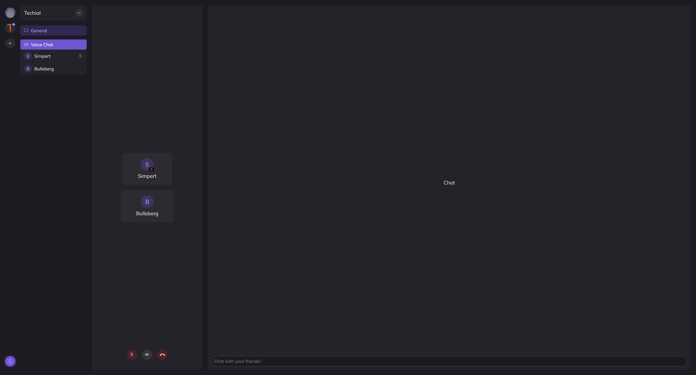

# 🌩️ WebRTC Client | Signaling Server | SFU

Welcome to the super early alpha release of our WebRTC SFU project! This repository contains a WebSocket client, signaling server, and SFU (Selective Forwarding Unit), leveraging Typescript for the client and signaling server, and Go for the SFU. This project is primarily a learning platform for exploring WebRTC and related services.

## 📸 Preview

## ✨ Features

- **WebSocket Client**: Typescript-based client for interacting with the signaling server.
- **Signaling Server**: Node.js-based server handling signaling between clients and SFU.
- **SFU (Selective Forwarding Unit)**: Go-based implementation based on pion's WebRTC.

## 🛠️ Production Requirements

- **STUN Server**: Necessary for using the SFU outside of a local network. Using public stun servers are fine but performance might vary heavily. We recommend [coturn](https://github.com/coturn/coturn).
- **Domain and SSL**: For secure connections in a production environment, set up TSL/SSL with your own domain.

## 🚀 Getting Started

1. Clone the repository.
2. Install dependencies for both the Typescript (client and server) and Go (SFU) components.
3. (optional) Set up and configure your STUN server using coturn.
4. Configure your domain with TSL/SSL certificates (required for WebRTC).
5. Start the signaling server and SFU.
6. Connect clients and start experimenting with WebRTC!

## 🤝 Contributing

We welcome contributions and feedback! If you encounter any issues or have suggestions, please open an issue on GitHub. We're excited to improve this project together!

## 📄 License

This project is licensed under the [MIT License](LICENSE).
