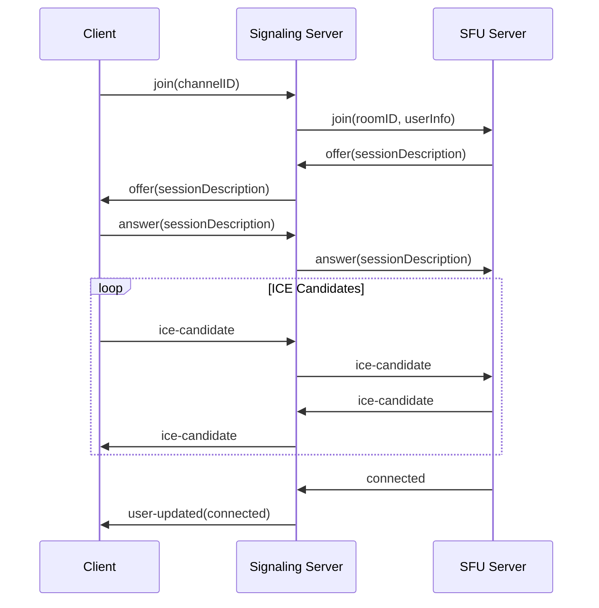

# 🖥️ Gryt Signaling Server

The Gryt Signaling Server is a Node.js/TypeScript application that manages WebRTC signaling, user sessions, and room coordination. It acts as the central hub for client communication and coordinates with the SFU for media forwarding.

## ✨ Features

### 🔄 **WebRTC Signaling**
- **Offer/Answer Exchange**: Coordinates WebRTC negotiation between clients and SFU
- **ICE Candidate Relay**: Handles network traversal and connection establishment
- **Connection State Management**: Tracks and synchronizes connection states
- **Renegotiation Support**: Handles dynamic track addition/removal

### 👥 **User & Room Management**
- **Multi-room Support**: Isolated voice channels with unique room IDs
- **User State Synchronization**: Real-time updates of mute, connection, and speaking states
- **Nickname Management**: Dynamic nickname updates across all connected clients
- **Presence Tracking**: Accurate user presence and connection status

### 🌐 **Multi-Server Architecture**
- **Server Identification**: Unique server names and branding
- **Room Isolation**: Server-prefixed room IDs prevent cross-server conflicts
- **Scalable Design**: Support for multiple server instances
- **Load Distribution**: Efficient handling of concurrent connections

### 🔌 **WebSocket Communication**
- **Real-time Messaging**: Instant bidirectional communication
- **Connection Recovery**: Automatic reconnection handling
- **Event Broadcasting**: Efficient message distribution to room members
- **Rate Limiting**: Protection against spam and abuse

## 🏗️ Architecture

The server follows a clean, event-driven architecture:

```
┌─────────────────┐    ┌─────────────────┐    ┌─────────────────┐
│   Web Client    │◄──►│ Signaling Server│◄──►│   SFU Server    │
│                 │    │                 │    │                 │
│ • WebSocket     │    │ • User Mgmt     │    │ • Media Relay   │
│ • UI Updates    │    │ • Room Mgmt     │    │ • WebRTC        │
│ • User Input    │    │ • Signaling     │    │ • Track Mgmt    │
└─────────────────┘    └─────────────────┘    └─────────────────┘
                                │
                       ┌─────────────────┐
                       │  Auth Service   │
                       │ (Hosted by Gryt)│
                       │                 │
                       │ • Validation    │
                       │ • Sessions      │
                       └─────────────────┘
```

> **Note**: Authentication is provided as a centrally hosted service by the Gryt team. Your signaling server connects to the official Gryt Auth API for user validation and session management.

### Core Components

| Component | Purpose | Responsibilities |
|-----------|---------|------------------|
| **WebSocket Handler** | Client communication | Connection management, message routing |
| **Room Manager** | Room coordination | User tracking, state synchronization |
| **Signaling Coordinator** | WebRTC signaling | Offer/answer relay, ICE handling |
| **User Manager** | User state | Nickname, mute, presence tracking |

## 🚀 Getting Started

### Prerequisites
- **Node.js** 18+
- **Bun** (recommended) or npm
- **SFU Server** running on port 5005

### Installation

1. **Navigate to server directory**
   ```bash
   cd webrtc/server
   ```

2. **Install dependencies**
   ```bash
   bun install
   # or
   npm install
   ```

3. **Configure environment**
   ```bash
   cp .env.example .env
   # Edit .env with your configuration
   ```

4. **Start development server**
   ```bash
   bun dev
   # or
   npm run dev
   ```

### Environment Configuration

Create a `.env` file based on `example.env`:

```bash
# Port clients connect to
PORT=5000

# Your secure SFU host
SFU_WS_HOST="wss://sfu_host.com"

# Comma separated list of URLs
STUN_SERVERS="stun:stun.l.google.com:19302"

# Name of the server
SERVER_NAME="My Brand New Server"

# Icon of the server (filename in the public folder)
SERVER_ICON="example.png"

# Clients need invite to join
SERVER_INVITE_ONLY="false"

# Websocket allowed origins
CORS_ORIGIN="https://gryt.chat"

# Websocket secret token (also used for SFU authentication)
SERVER_TOKEN="123"

# Authentication endpoint (add this to your .env)
GRYT_AUTH_API=https://auth.gryt.chat

# ScyllaDB (Cassandra-compatible) configuration
SCYLLA_CONTACT_POINTS=127.0.0.1
SCYLLA_LOCAL_DATACENTER=datacenter1
SCYLLA_KEYSPACE=gryt
# SCYLLA_USERNAME=
# SCYLLA_PASSWORD=

# S3 / Object storage (AWS S3, Cloudflare R2, Wasabi, MinIO)
S3_REGION=auto
# For AWS, endpoint can be omitted
# For MinIO/R2, set a custom endpoint like http://localhost:9000
# S3_ENDPOINT=
S3_ACCESS_KEY_ID=
S3_SECRET_ACCESS_KEY=
S3_BUCKET=gryt-bucket
# For MinIO/self-hosted set to true
S3_FORCE_PATH_STYLE=false

# Development
NODE_ENV=development
DEBUG=gryt:*
```

## 🎯 API Reference

### WebSocket Events

#### Client → Server

| Event | Payload | Description |
|-------|---------|-------------|
| `join` | `{ channelID: string }` | Join a voice channel |
| `leave` | `{}` | Leave current voice channel |
| `updateNickname` | `string` | Update user nickname |
| `updateMute` | `boolean` | Update mute state |
| `offer` | `RTCSessionDescription` | WebRTC offer for SFU |
| `answer` | `RTCSessionDescription` | WebRTC answer from SFU |
| `ice-candidate` | `RTCIceCandidate` | ICE candidate for connection |

#### Server → Client

| Event | Payload | Description |
|-------|---------|-------------|
| `info` | `ServerInfo` | Server information and channels |
| `users` | `UserList` | Current users in channels |
| `user-joined` | `UserInfo` | User joined notification |
| `user-left` | `UserInfo` | User left notification |
| `user-updated` | `UserInfo` | User state changed |
| `offer` | `RTCSessionDescription` | WebRTC offer from SFU |
| `answer` | `RTCSessionDescription` | WebRTC answer to SFU |
| `ice-candidate` | `RTCIceCandidate` | ICE candidate from SFU |

### REST Endpoints

#### Messages
- `GET /api/messages/:conversationId?limit=50&before=<ISO>`
  - Returns `{ items: Message[] }` sorted by `created_at` ascending
- `POST /api/messages/:conversationId`
  - Body: `{ senderId: string, text?: string, attachments?: string[] }`
  - Returns created `Message`

#### Uploads
- `POST /api/uploads` (multipart/form-data)
  - Field `file`: the file to upload
  - Stores file in S3-compatible storage; if image, generates a 320px JPEG thumbnail
  - Returns `{ fileId, key, thumbnailKey }`

### Data Structures

```typescript
interface ServerInfo {
  name: string;
  members: string;
  channels: Channel[];
}

interface Channel {
  id: string;
  name: string;
  type: 'voice' | 'text';
}

interface UserInfo {
  id: string;
  nickname: string;
  isMuted: boolean;
  hasJoinedChannel: boolean;
  isConnectedToVoice: boolean;
  streamID?: string;
}
```

## 🔧 Configuration

### Server Settings

```typescript
interface ServerConfig {
  port: number;
  serverName: string;
  serverIcon: string;
  sfuWsHost: string;
  stunHosts: string[];
  maxConnections: number;
  rateLimitWindow: number;
  rateLimitMax: number;
}
```

### Room Configuration

```typescript
interface RoomConfig {
  maxUsers: number;
  autoCleanup: boolean;
  cleanupDelay: number;
  roomPrefix: string; // Server name prefix
}
```

## 🎛️ Room Management

### Room Lifecycle

1. **Room Creation**: Automatic when first user joins
2. **User Tracking**: Real-time presence and state updates
3. **State Synchronization**: Broadcast changes to all room members
4. **Room Cleanup**: Automatic cleanup when empty

### Unique Room IDs

To prevent conflicts between servers, room IDs are prefixed:

```typescript
// Original channel: "voice"
// Server: "techial.example.com"
// Unique room ID: "techial_voice"

const createRoomId = (serverName: string, channelId: string): string => {
  const prefix = serverName.split('.')[0]; // "techial"
  return `${prefix}_${channelId}`;
};
```

### User State Management

```typescript
interface UserState {
  id: string;
  nickname: string;
  isMuted: boolean;
  hasJoinedChannel: boolean;
  isConnectedToVoice: boolean;
  streamID?: string;
  lastSeen: Date;
  connectionState: 'connecting' | 'connected' | 'disconnected';
}
```

## 🔄 WebRTC Signaling Flow

### Connection Establishment



### Track Management

```typescript
// When user starts transmitting
client.on('track-added', (trackInfo) => {
  // Update user state
  user.streamID = trackInfo.streamID;
  user.isConnectedToVoice = true;
  
  // Broadcast to room
  broadcastToRoom(roomId, 'user-updated', user);
});

// When user stops transmitting
client.on('track-removed', (trackInfo) => {
  user.isConnectedToVoice = false;
  broadcastToRoom(roomId, 'user-updated', user);
});
```

## 🐛 Troubleshooting

### Common Issues

**WebSocket connection fails?**
```bash
# Check server is running
curl http://localhost:5000/health

# Verify WebSocket upgrade
wscat -c ws://localhost:5000

# Check firewall settings
sudo ufw status
```

**SFU communication issues?**
```bash
# Verify SFU is running
curl http://localhost:5005/health

# Check WebSocket connection to SFU
wscat -c ws://localhost:5005

# Review server logs
DEBUG=gryt:* bun dev
```

**Room state synchronization problems?**
```bash
# Enable detailed logging
DEBUG=gryt:room,gryt:user bun dev

# Check room state
# Access /debug/rooms endpoint (development only)
curl http://localhost:5000/debug/rooms
```

### Debug Endpoints (Development Only)

| Endpoint | Description |
|----------|-------------|
| `GET /health` | Server health check |
| `GET /debug/rooms` | Current room states |
| `GET /debug/users` | Connected users |
| `GET /debug/connections` | WebSocket connections |

## 🧪 Testing

```bash
# Run all tests
bun test

# Run specific test suites
bun test websocket
bun test signaling
bun test rooms

# Integration tests
bun test:integration

# Load testing
bun test:load
```

### Test Configuration

```typescript
// test/setup.ts
interface TestConfig {
  mockSFU: boolean;
  testPort: number;
  testTimeout: number;
  maxTestUsers: number;
}
```

## 📦 Dependencies

### Core Dependencies
- **Socket.IO**: WebSocket communication with fallbacks
- **Express**: HTTP server and middleware
- **TypeScript**: Type safety and developer experience
- **Winston**: Structured logging

### Development Dependencies
- **Vitest**: Fast testing framework
- **Supertest**: HTTP testing utilities
- **Socket.IO Client**: WebSocket testing
- **ESLint/Prettier**: Code quality tools

## 🚀 Production Deployment

### Docker Deployment

```dockerfile
FROM node:18-alpine
WORKDIR /app
COPY package*.json ./
RUN npm ci --only=production
COPY . .
RUN npm run build
EXPOSE 5000
CMD ["npm", "start"]
```

### Environment Variables

```bash
# Production Configuration
NODE_ENV=production
PORT=5000
SERVER_NAME="Production Server"

# SFU Configuration
SFU_WS_HOST=wss://sfu.yourdomain.com

# STUN/TURN Configuration
STUN_SERVERS="stun:your-stun-server.com:3478"

# Authentication
GRYT_AUTH_API=https://auth.gryt.chat

# Security
CORS_ORIGIN=https://yourdomain.com
RATE_LIMIT_WINDOW=900000
RATE_LIMIT_MAX=100

# Monitoring
LOG_LEVEL=info
METRICS_ENABLED=true
```

### Health Checks

```bash
# Kubernetes health check
curl -f http://localhost:5000/health || exit 1

# Docker health check
HEALTHCHECK --interval=30s --timeout=3s --start-period=5s --retries=3 \
  CMD curl -f http://localhost:5000/health || exit 1
```

## 🤝 Contributing

### Development Workflow

1. **Setup development environment**
   ```bash
   bun install
   cp .env.example .env
   bun dev
   ```

2. **Make changes with proper types**
   ```typescript
   // Always include comprehensive types
   interface WebSocketMessage {
     event: string;
     data: unknown;
     timestamp: Date;
     userId: string;
   }
   ```

3. **Test thoroughly**
   ```bash
   bun test
   bun run type-check
   bun run lint
   ```

4. **Update documentation**
   - Add JSDoc comments
   - Update API documentation
   - Include usage examples

### Code Style
- Use TypeScript strict mode
- Implement proper error handling
- Add comprehensive logging
- Follow event-driven patterns
- Write testable code

---

**Part of the [Gryt Voice Chat Platform](/docs)**
